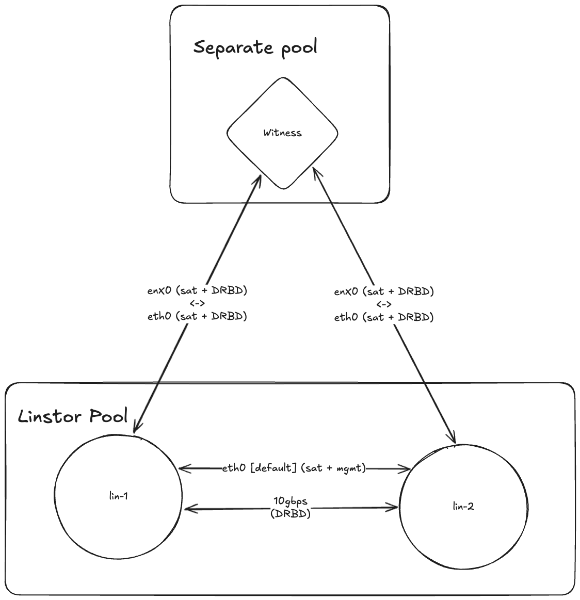

# XOSTOR Witness scripts

In any case, the witness VM should not run on a node of the LINSTOR pool, but on a separate host.
It is recommended to use a dedicated, possibly a remote host for the witness VM.

The witness VM should have access to the LINSTOR pool network and be able to communicate with the LINSTOR nodes.
The witness VM will act as a TieBreaker and will help to keep the quorum of the LINSTOR pool in the case of a pool with only two nodes.

If the ssh keys are not provided, ssh will ask for the root password to connect to each remote host (witness VM and LINSTOR node).
The script will first ask for the current password of the root user on the remote hosts when copying the ssh key if provided.
Then the ssh key should be used.

The script should be run from the `./provision` directory.

## Table of contents

- [Deploying the witness VM](#deploying-the-witness-vm)
   * [On an existing VM](#on-an-existing-vm)
   * [From a template VM](#from-a-template-vm)
- [Creating a template VM](#creating-a-template-vm)
- [Updating the witness VM](#updating-the-witness-vm)
   * [Updating in-place](#updating-in-place)
   * [Using a new VM](#using-a-new-vm)
      + [On an existing VM](#on-an-existing-vm-1)
      + [From a template VM](#from-a-template-vm-1)
- [Setting up paths and interfaces](#setting-up-paths-and-interfaces)
   * [Preparing the network path with a `PrefNIC` set on the nodes](#preparing-the-network-path-with-a-prefnic-set-on-the-nodes)
   * [Alternative: Preparing the network path removing the `PrefNIC` from the nodes](#alternative-preparing-the-network-path-removing-the-prefnic-from-the-nodes)
   * [If there is no `PrefNIC` set on any node](#if-there-is-no-prefnic-set-on-any-node)

## Deploying the witness VM

### On an existing VM

This script will provision a witness VM on an existing VM.
It requires an existing LINSTOR pool and an AlmaLinux >=9 VM.

```bash
./provision-witness from-existing \
  --witness-ip           <IP of the target VM> \
  --cluster-ip           <IP of one of the nodes of the linstor pool> \
  --cluster-ssh-key      <Optional: Path to the ssh key of the linstor pool> \
  --set-hostname         <Optional: hostname. defaults to witness> \
  --set-ssh-key-path     <Optional: path to the public ssh key to send to the witness> \
  --set-password         <Optional: password for the root user> \
  --skip-setup           <Optional: if set, the script will skip the setup of the witness VM> \
  --skip-drbd            <Optional: if set, the script will skip the DRBD installation on the witness VM> \
  --skip-linstor         <Optional: if set, the script will skip the LINSTOR satellite installation on the witness VM>
```

### From a template VM

This script will create a witness VM from a template VM.
It requires an existing LINSTOR pool and a template VM that has been provisioned with the LINSTOR client installed.

To create a template VM, please refer to the [Creating a template VM](#creating-a-template-vm) section below.

```bash
./provision-witness from-template \
  --template-xva-path    <Path to the template XVA> \
  --vm-name              <Name of the target VM> \
  --vm-network           <UUID of the network to use for the witness VM> \
  --vm-sr                <UUID of the SR to create the target VM in> \
  --cluster-ip           <IP of one of the nodes of the linstor pool> \
  --cluster-ssh-key      <Optional: Path to the ssh key of the linstor pool> \
  --host-ip              <Optional: IP of the witness VM host> \
  --host-ssh-key-path    <Optional: path to the ssh key to access the host> \
  --set-hostname         <Optional: hostname. defaults to witness> \
  --set-ssh-key-path     <Optional: path to the public ssh key to send to the witness> \
  --set-password         <Optional: password for the root user>
```

If `--host-ip` is not provided, the script will assume the current host is the one that will host the witness VM.


## Creating a template VM

To create a template VM, use the `make-template` command on an existing AlmaLinux >=9 VM
and then use the newly provisioned VM as a template for future witness VMs.

The command will follow the same steps as for provisioning the witness VM from an existing VM, but will also
strip identifying information from the VM to make it reusable as a template. Then it will shut the vm down.
It will also skip the step of adding the VM to the LINSTOR pool as it is not necessary for a template VM.

```bash
./provision-witness make-template \
  --witness-ip           <IP of the target VM> \
  --set-hostname         <Optional: hostname. defaults to witness> \
  --set-ssh-key-path     <Optional: path to the public ssh key to send to the witness> \
  --set-password         <Optional: password for the root user> \
  --skip-setup           <Optional: if set, the script will skip the setup of the witness VM> \
  --skip-drbd            <Optional: if set, the script will skip the DRBD installation on the witness VM> \
  --skip-linstor         <Optional: if set, the script will skip the LINSTOR satellite installation on the witness VM>
```

The resulting VM is now ready to be converted as a template or exported as an XVA to be used as a template for future witness VMs.

## Updating the witness VM

Updating the witness VM can be done in two ways:
- Updating the witness VM in place, which will keep the same VM and update its configuration.
- Using a new VM, which will provision a new witness VM and migrate the witness resource to
the new VM.

The update command can be used to update the witness VM or to change its configuration, 
for example to change the ssh key or the password.

### Updating in-place

The script will follow the same steps as for provisioning the witness VM from an existing VM 
except for those differences:

- Unless any configuration has changed, the `--set-*` options 
can be omitted to keep the current configuration of the witness VM.
- Since it is done in place, the step were the node is added to the LINSTOR pool will be skipped 
and the `--cluster-*` options are not used.

To update in place:

```bash
./provision-witness update-in-place \
  --witness-ip <IP of the target VM>
  # The other options are available, but wouldn't make sense in most cases
```

### Using a new VM

The script will follow the same steps as either the provisioning the witness VM from an existing VM 
or from a template VM.

The two following flags are added to the command, 
to respectively specify the name of the old witness VM and if it should be deleted.

It is important that the new witness node doesn't have the same name 
as the old witness node to avoid conflicts in the LINSTOR pool.

The process is as follows:
- A new witness VM is provisioned/created
- The new witness VM is added to the LINSTOR pool
- The old witness VM is evacuated, which will migrate the witness resource to the new witness VM.
- Optionally, the old witness VM is deleted.

#### On an existing VM
```bash
./provision-witness update-from-new from-existing \
  --witness-ip           <IP of the target VM> \
  --evacuate-node        <Name of the old witness VM to evacuate> \
  --cluster-ip           <IP of one of the nodes of the linstor pool> \
  --cluster-ssh-key      <Optional: Path to the ssh key of the linstor pool> \
  --remove-node          <Optional: if set, the old witness VM will be deleted after the evacuation> \
  --set-hostname         <Optional: hostname. defaults to witness> \
  --set-ssh-key-path     <Optional: path to the public ssh key to send to the witness> \
  --set-password         <Optional: password for the root user> \
  --skip-setup           <Optional: if set, the script will skip the setup of the witness VM> \
  --skip-drbd            <Optional: if set, the script will skip the DRBD installation on the witness VM> \
  --skip-linstor         <Optional: if set, the script will skip the LINSTOR satellite installation on the witness VM>
```

#### From a template VM
```bash
./provision-witness update-from-new from-template \
  --template-xva-path    <Path to the template XVA> \
  --vm-name              <Name of the target VM> \
  --vm-network           <UUID of the network to use for the witness VM> \
  --vm-sr                <UUID of the SR to create the target VM in> \
  --cluster-ip           <IP of one of the nodes of the linstor pool> \
  --evacuate-node        <Name of the old witness VM to evacuate> \
  --cluster-ssh-key      <Optional: Path to the ssh key of the linstor pool> \
  --remove-node          <Optional: if set, the old witness VM will be deleted after the evacuation> \
  --host-ip              <Optional: IP of the witness VM host> \
  --host-ssh-key-path    <Optional: path to the ssh key to access the host> \
  --set-hostname         <Optional: hostname. defaults to witness> \
  --set-ssh-key-path     <Optional: path to the public ssh key to send to the witness> \
  --set-password         <Optional: password for the root user>
```


## Setting up paths and interfaces

As it is recommended to have a dedicated 10Gbps network for the LINSTOR nodes, 
and that the witness VM should not run on the same pool as the LINSTOR nodes,
it is likely that the witness VM doesn't have access to the 10Gbps network.
Therefore, it is necessary to set up the paths and interfaces 
for the witness VM to be able to communicate with the LINSTOR nodes.

Let's imagine a setup with the following network topology:



In a typical setup before adding the witness, there are two likely situations:
- Either a `PrefNic` is set
- Either a node-connection path is set

To check which situation is in place:

- Check for existing interfaces on each node:
```bash
linstor node interface list lin-1
╭──────────────────────────────────────────────────────────────────╮
┊ r620-s1   ┊ NetInterface ┊ IP            ┊ Port ┊ EncryptionType ┊
╞══════════════════════════════════════════════════════════════════╡
┊ + StltCon ┊ default      ┊ 10.0.0.11     ┊ 3366 ┊ PLAIN          ┊
┊ +         ┊ 10g          ┊ 192.168.1.11  ┊      ┊                ┊
╰──────────────────────────────────────────────────────────────────╯
```
```bash
linstor node interface list lin-1
╭──────────────────────────────────────────────────────────────────╮
┊ r620-s1   ┊ NetInterface ┊ IP            ┊ Port ┊ EncryptionType ┊
╞══════════════════════════════════════════════════════════════════╡
┊ + StltCon ┊ default      ┊ 10.0.0.12     ┊ 3366 ┊ PLAIN          ┊
┊ +         ┊ 10g          ┊ 192.168.1.12  ┊      ┊                ┊
╰──────────────────────────────────────────────────────────────────╯
```

- Check for a `PrefNIC` set on each node:
```bash
linstor node list-properties lin-1
╭───────────────────────────╮
┊ Key             ┊ Value   ┊
╞═══════════════════════════╡
┊ CurStltConnName ┊ default ┊
┊ NodeUname       ┊ lin-1   ┊
┊ PrefNIC         ┊ 10g     ┊
╰───────────────────────────╯
```
```bash
linstor node list-properties lin-2
╭───────────────────────────╮
┊ Key             ┊ Value   ┊
╞═══════════════════════════╡
┊ CurStltConnName ┊ default ┊
┊ NodeUname       ┊ lin-1   ┊
┊ PrefNIC         ┊ 10g     ┊
╰───────────────────────────╯
```

If there is a `PrefNIC` set on any node, the witness VM will use it to communicate with the LINSTOR nodes.
It will then be necessary to set up the corresponding path on the witness VM to use the default interface.

If there is no `PrefNIC` set on any node, the witness VM will use the default interface to communicate with the LINSTOR nodes.

- Check for existing paths on each node:
```bash
linstor node-connection path list lin-1 lin-2
╭────────────────────────────────────╮
┊ Key                  ┊ Value       ┊
╞════════════════════════════════════╡
┊ Paths/drbd/lin-1     ┊ 10g         ┊
┊ Paths/drbd/lin-2     ┊ 10g         ┊
╰────────────────────────────────────╯
```

If there is a path set between the two nodes, the two nodes will use the specified interface for DRBD traffic.
If there is no path set between the two nodes, the two nodes will use the PrefNic/default interface for DRBD traffic.

### Preparing the network path with a `PrefNIC` set on the nodes

These steps must be done after adding the witness node to the pool.
Assuming the witness VM is called `witness`.

Set up the corresponding path on the witness VM to use the default interface:
```bash
linstor node-connection path create lin-1 witness default default
```
This step is to be repeated for each node with a `PrefNIC` set.

### Alternative: Preparing the network path removing the `PrefNIC` from the nodes

It is also possible to remove the `PrefNIC` from the nodes and set up the paths on the nodes.
This will allow the witness VM to use the default interface to communicate with the LINSTOR nodes.

Create the path between the two hosts:
```bash
linstor node-connection path create lin-1 lin-2 default default
```

Remove the `PrefNIC` from the nodes:
```bash
linstor node set-property lin-1 PrefNIC
# This step is to be repeated for each node with a `PrefNIC` set.
```

This order is important to avoid using the default interface with the nodes when removing the `PrefNIC`.

### If there is no `PrefNIC` set on any node

Nothing needs to be done on the witness VM as it will use the default interface to communicate with the LINSTOR nodes.
